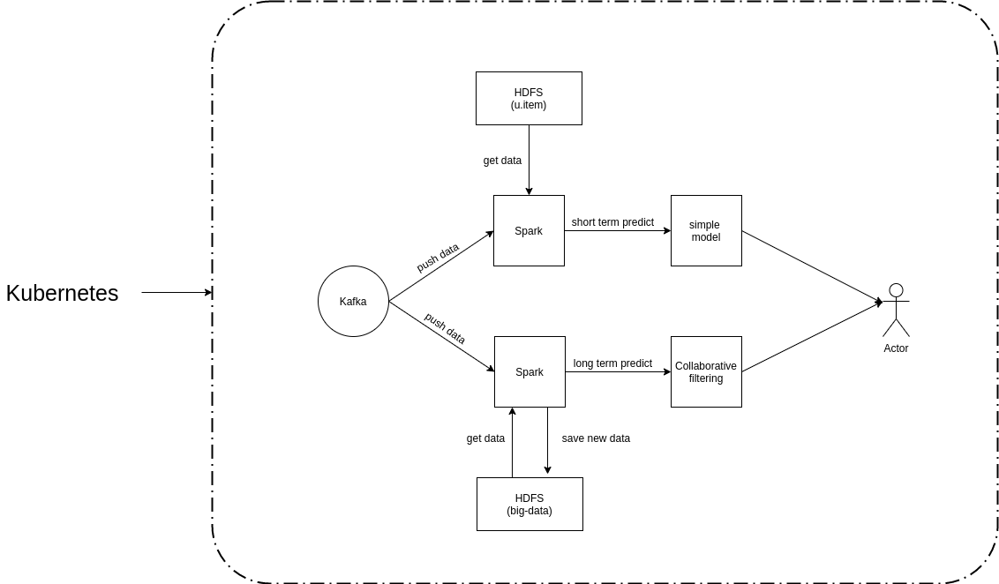

# Movie recommended system

## Design architecture  



## Installation

```
./setup.sh
```

## Usage

After run `setup.sh`, we obtain an jupyter notebook url. Open it in your browser, and then open file `big_data.ipynb`. All you need is in this notebook.

## Kubernetes command

I wrote some bash script in `bin` folder.  

```
hacmao@hacmao-Inspiron-15-3567:~/Documents/bigdata$ ls ./bin
dashboard.sh       get_jupyter.sh  helm_notebook.sh  namenode_sh.sh  pod.sh      setup_namenode.sh
delete_err_pod.sh  helm_hdfs.sh    helm_remove.sh    nodes.sh        service.sh
```
